# API de gestión de tareas con FastAPI

API REST desarrollada como parte del taller de **Sistemas Distribuidos**. Permite crear, consultar, actualizar, eliminar y filtrar tareas. La información se almacena localmente en el archivo `tareas.json`.

## Tecnologías utilizadas

- Python 3.12
- FastAPI
- Pydantic
- Uvicorn
- JSON para la persistencia de datos
- Swagger UI para probar los endpoints

## Estructura del proyecto

```text
Fast_Api/
├── taller-fastapi/
│   ├── imagenes/             # Evidencias de los ejercicios
│   ├── venv/
│   │   ├── main.py           # Endpoints de la API
│   │   ├── modelos.py        # Modelos de datos de Pydantic
│   │   └── almacenamiento.py # Lectura y escritura del archivo JSON
│   ├── TALLER_FAST_API.md    # Desarrollo conceptual del taller
│   └── tareas.json           # Almacenamiento de las tareas
└── README.md
```

## Modelo de una tarea

Cada tarea contiene los siguientes campos:

```json
{
  "id": 1,
  "titulo": "Estudiar REST",
  "descripcion": "Repasar los conceptos de una API REST",
  "completada": false
}
```

El campo `id` es generado automáticamente por el servidor. `descripcion` es opcional y `completada` tiene como valor predeterminado `false`.

## Instalación y ejecución

1. Ingrese al directorio del proyecto:

   ```powershell
   cd taller-fastapi
   ```

2. Active el entorno virtual en Windows PowerShell:

   ```powershell
   .\venv\Scripts\Activate.ps1
   ```

3. Si necesita instalar las dependencias en un entorno nuevo:

   ```powershell
   pip install fastapi uvicorn
   ```

4. Inicie el servidor desde la carpeta `taller-fastapi`:

   ```powershell
   uvicorn main:app --app-dir venv --reload
   ```

La API quedará disponible en `http://127.0.0.1:8000` y la documentación interactiva de Swagger en:

```text
http://127.0.0.1:8000/docs
```

> Es importante ejecutar el comando desde `taller-fastapi`, ya que la ruta del archivo de almacenamiento es relativa al directorio actual.

## Endpoints

| Método | Ruta | Descripción |
| --- | --- | --- |
| `POST` | `/tareas` | Crea una tarea |
| `GET` | `/tareas` | Lista todas las tareas |
| `GET` | `/tareas/{tarea_id}` | Consulta una tarea por su identificador |
| `PUT` | `/tareas/{tarea_id}` | Actualiza todos los datos de una tarea |
| `DELETE` | `/tareas/{tarea_id}` | Elimina una tarea |
| `GET` | `/tareas?completada=true` | Filtra las tareas por estado |

## Desarrollo de los ejercicios

### 1. Creación de al menos tres tareas

Se utilizó `POST /tareas` desde Swagger UI para registrar las tareas. El servidor asignó automáticamente un identificador a cada una.

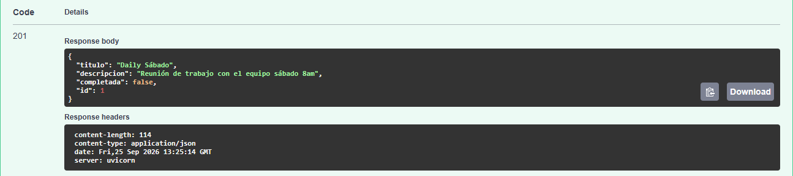


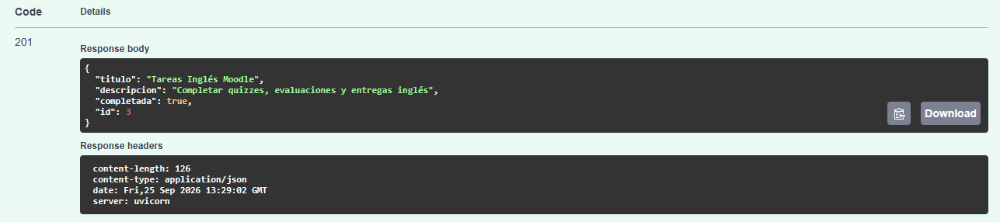

### 2. Consulta del listado de tareas

Se ejecutó `GET /tareas` para comprobar que las tareas fueron almacenadas correctamente.

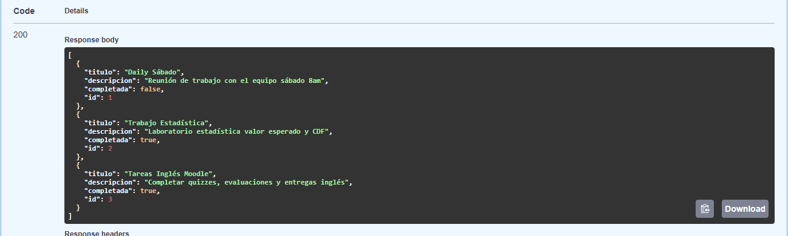

### 3. Consulta de una tarea por id

Se consultó una tarea específica mediante `GET /tareas/{tarea_id}`.

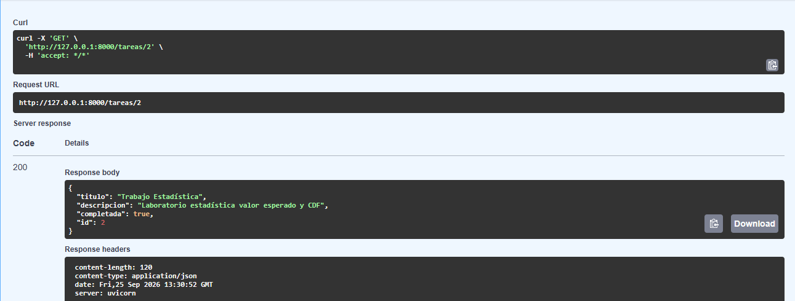

### 4. Consulta de un id inexistente

Al solicitar una tarea que no existe, la API respondió con el código HTTP `404 Not Found`.

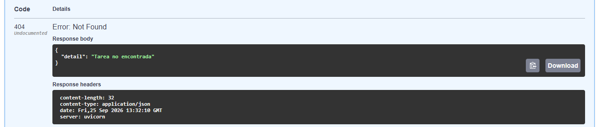

### 5. Verificación del archivo JSON

Se abrió `tareas.json` en el editor para verificar que la información enviada a la API quedó guardada de forma persistente.

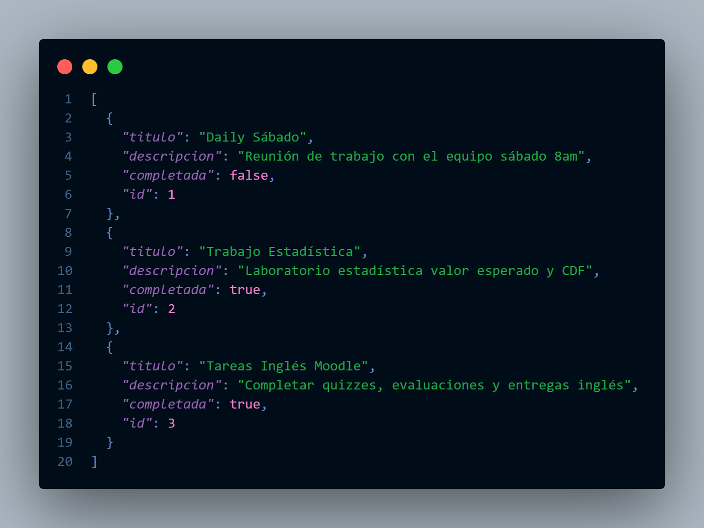

### 6. Creación de tareas con diferentes estados

Se registraron al menos cinco tareas utilizando valores `true` y `false` en el campo `completada`. Las evidencias de creación y el listado general muestran los distintos estados almacenados.

### 7. Actualización de dos tareas

Se utilizó `PUT /tareas/{tarea_id}` para modificar el título y el estado de dos tareas existentes.

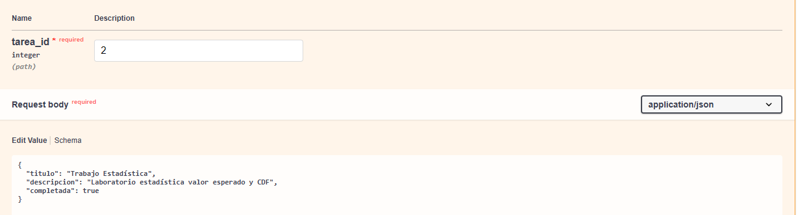

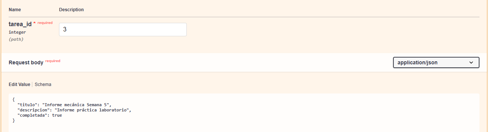

> Como se trata de una operación `PUT`, se envían todos los campos editables de la tarea: `titulo`, `descripcion` y `completada`.

### 8. Eliminación de una tarea

Se eliminó una tarea mediante `DELETE /tareas/{tarea_id}`. La operación respondió con el código `204 No Content` y posteriormente se verificó que el elemento ya no aparecía en el listado.

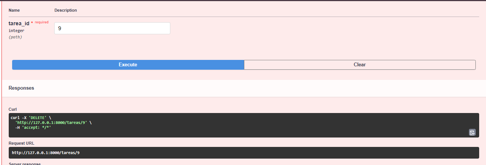

### 9. Filtro de tareas completadas

Se utilizó el parámetro de consulta `completada=true` para obtener únicamente las tareas finalizadas:

```http
GET /tareas?completada=true
```

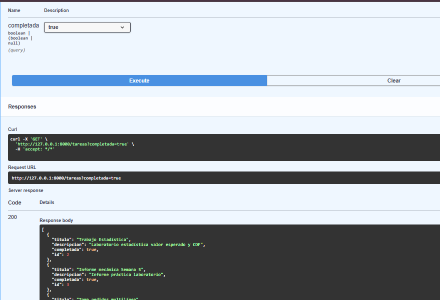

También es posible consultar las tareas pendientes con `GET /tareas?completada=false`.

### 10. Pruebas desde la terminal con curl

Además de Swagger UI, se probaron operaciones directamente desde la terminal.

Consulta de todas las tareas:

```powershell
curl.exe http://127.0.0.1:8000/tareas
```

Creación de una tarea:

```powershell
curl.exe -X POST "http://127.0.0.1:8000/tareas" `
  -H "Content-Type: application/json" `
  -d '{"titulo":"Tarea desde curl","descripcion":"Prueba desde la terminal","completada":false}'
```

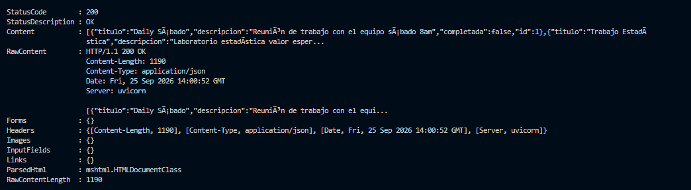

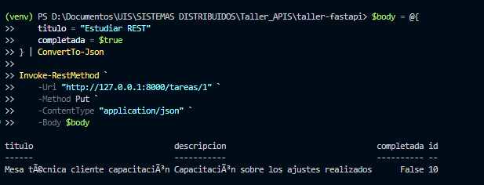

## Códigos de respuesta principales

| Código | Significado |
| --- | --- |
| `200 OK` | Consulta o actualización realizada correctamente |
| `201 Created` | Tarea creada correctamente |
| `204 No Content` | Tarea eliminada correctamente |
| `404 Not Found` | No existe una tarea con el id indicado |
| `422 Unprocessable Entity` | Los datos enviados no cumplen el modelo esperado |
